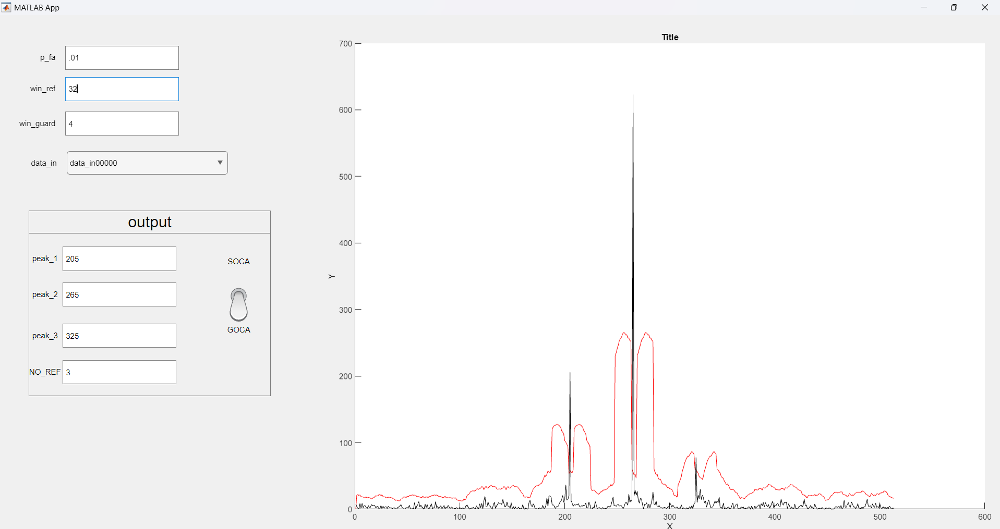
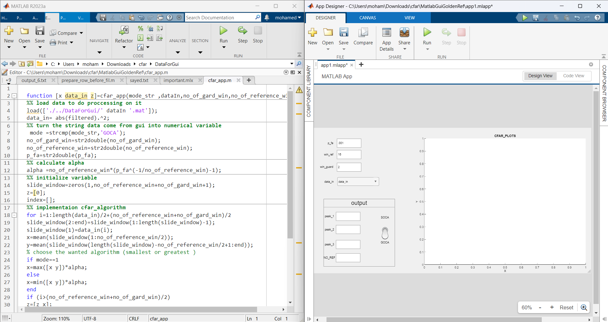
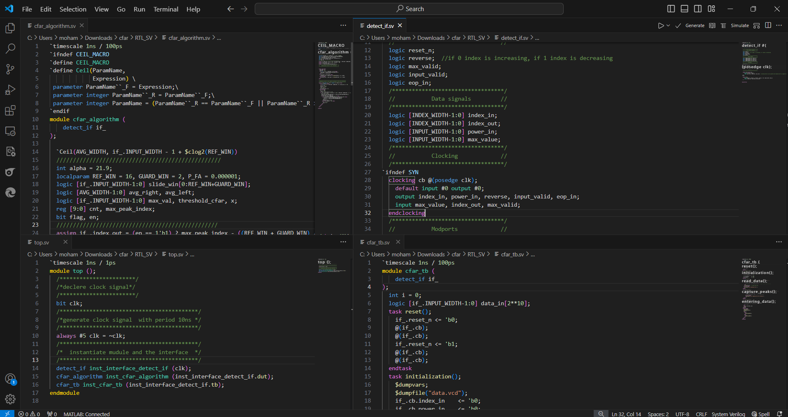
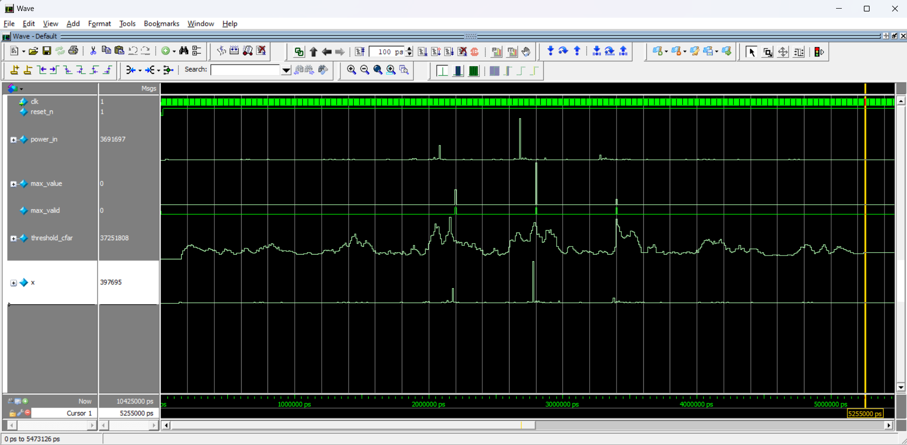

# CFAR Algorithm Project

## Project Overview

This project implements two types of CFAR (Constant False Alarm Rate) algorithms: SOCA (Smallest Of Cell Averaging) and GOCA (Greatest Of Cell Averaging). The project is organized into four main folders, each serving a specific purpose related to the implementation and testing of these algorithms.

## Folder Structure

### 1. DataForGui
- **Description:** Contains the input data required for the MATLAB files.
- **Contents:**
  - `file.mat`: The input data file used by the MATLAB algorithms.

### 2. MatlabGuiGoldenRef
- **Description:** This folder includes the MATLAB implementation of the CFAR algorithm and a GUI app for tuning parameters.
- **Contents:**
  - `app1.mlapp`: The MATLAB GUI application to assist in tuning the CFAR parameters.
  - `cfar_app.m`: The MATLAB file containing the CFAR algorithm, which serves as the golden reference for the project.

### 3. RTL_SV
- **Description:** Contains the HDL files for implementing the SOCA and GOCA algorithms in digital IC design.
- **Contents:**
  - `cfar_algorithm.sv`: The HDL file implementing the CFAR algorithm.
  - `cfar_tb.sv`: The test bench for the CFAR design.
  - `detect_if.sv`: The interface between the DUT (Device Under Test) and the test bench.
  - `top.sv`: The top-level file containing the DUT and test bench.

### 4. Screens
- **Description:** Screenshots of results from various stages of the project.
- **Contents:**
  - `screen_from_gui_GOCA.png`: Screenshot of the running GUI app for GOCA.
    
  - `screen_of_gui_matlab.png`: Screenshot of the MATLAB code and the UI of App Designer.
    
  - `screen_of_rtl.png`: Screenshot of the RTL written in SystemVerilog.
  
- `screen_of_questasim_result.png`: Screenshot of RTL results from simulation in Questasim.

## How to Run the Project

### MATLAB GUI
1. Open `file.mat` in MATLAB.
2. Run `cfar_app.m` to execute the CFAR algorithm.
3. Open and run `app1.mlapp` to launch the GUI and tune the CFAR parameters for both SOCA and GOCA.

### HDL Implementation
1. Use a hardware description language simulator such as Questasim.
2. Load the following files from the `RTL_SV` folder:
   - `cfar_algorithm.sv`: The main CFAR algorithm implementation.
   - `cfar_tb.sv`: The test bench for the CFAR algorithm.
   - `detect_if.sv`: The interface between the DUT and the test bench.
   - `top.sv`: The top-level module integrating the DUT and the test bench.
3. Simulate the design and verify the results against the screenshots provided in the `Screens` folder.

## Contributing

If you would like to contribute to this project, please fork the repository and use a feature branch. Pull requests are warmly welcome.
